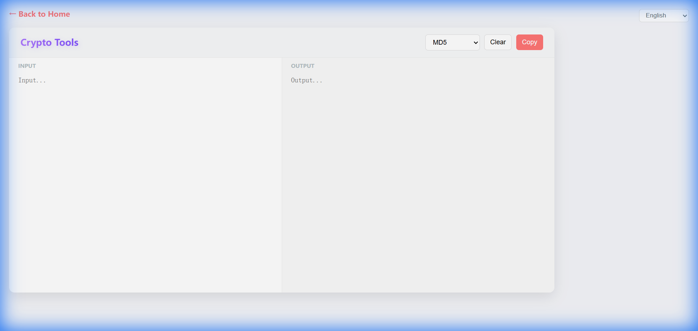
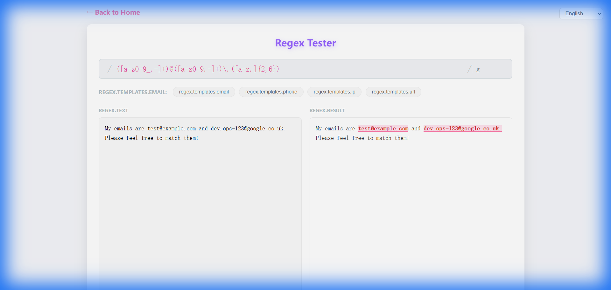

# Web 实用工具箱 (WebTools Dashboard)

> **🔗 在线演示**: [https://gongteng0215.github.io/webTools/](https://gongteng0215.github.io/webTools/)

一个高度集成、极简高密度的现代开发者在线工具箱，基于 **Vue 3 + Vite** 开发。旨在提供“一站式”的常用开发辅助功能，无需切换标签页或搜索第三方网站。

## 📸 项目截图


*极简风格的高密度控制面板，集成 16 款常用工具。*



*交互式、实时响应的工具界面。*

## 🚀 核心特性

- **19 合 1 全能工具箱**：涵盖加解密、配置转换、网络请求、UI 设计等多个维度。
- **实时响应**：几乎所有工具都支持输入即输出，提供极致的交互反馈。
- **高密度仪表盘**：采用极简风格的“控制面板”布局，工具一目了然，减少滚动。
- **Spring Boot 友好**：专项支持 `.properties` 与 `YAML` 的深度互转。
- **国际化支持**：内置中英双语切换，自动适配浏览器语言。
- **隐私安全**：所有计算均在浏览器本地完成，数据不上传服务器。

## 🛠️ 已集成工具

### 🛡️ 核心工具
1. **随机密码生成器**：支持强度评估与多维度字符定制。
2. **Cron 生成器**：全内置高精度解析引擎，支持标准 Cron 语法，提供未来 7 次运行预测，复刻 crontab.guru 经典界面。
3. **JSON & CSV 实验室**：双向“源 -> 目标”转换器。支持 JSON/CSV/文本/转义字符串的互转，包含压缩 (Minify) 与智能数据交换功能。
4. **全能加密助手**：集成 AES, DES, MD5, SHA (1/256/512), Base64, URL 编码。
5. **JWT 调试器**：支持 JWS (签名) 与 JWE (加密) 的解析与生成。

### 🧩 实用助手
6. **时间戳转换**：秒/毫秒互转，带实时本地时钟。
7. **正则测试器**：实时匹配高亮，内置常用正则模板（邮箱、IP、手机等）。
8. **字符串/ID 实验室**：批量生成 UUID v4，支持驼峰/下划线等多种命名转换。
9. **颜色面板 (Pro)**：Material Design 色谱、自动阴影阶梯生成、多格式互转。
10. **文本对比 (Diff)**：高性能行内差异比对，支持高亮显示。

### ⚙️ 进阶神器
11. **图片 & Base64**：支持双向转换。图片转码或 Base64 字符串还原预览/下载。
12. **配置转换器**：YAML, JSON, Properties (Spring Boot) 三方互转。
13. **SQL 格式化**：支持多种数据库方言（MySQL, PG, SQLite 等）的美化排版。
14. **单位实验室**：存储容量 (B 到 TB) 与 CSS 单位 (px/rem) 极速换算。
15. **URL 解析器**：深度拆解 URL 组件，支持表格化可视化编辑 Query 参数。
16. **二维码助手**：文本或链接极速转二维码，支持定制尺寸与下载。
17. **Markdown 专业版**：支持实时分屏预览 GitHub 风格的 Markdown。
18. **User Agent 解析器**：深度分析 UA 字符串，识别浏览器、系统、内核及设备类型。
19. **API 调试终端**：轻量级 REST API 客户端，支持 GET/POST/PUT/DELETE 等常用 HTTP 请求调试。

## 💻 技术栈

- **框架**: [Vue.js 3](https://vuejs.org/) (Composition API)
- **路由**: [Vue Router 4](https://router.vuejs.org/)
- **构建**: [Vite](https://vitejs.dev/)
- **关键依赖**:
    - `crypto-js`, `jsencrypt`, `tweetnacl`, `jose`: 全方位加密支持.
    - `js-yaml`, `dot-properties`: 配置格式转换.
    - `sql-formatter`: SQL 美化.
    - `qrcode`: 二维码生成.
    - `dayjs`, `cronstrue`: 时间与 Cron 描述.
    - `diff-match-patch`: 文本比对.

## 快速开始

```bash
# 安装依赖
npm install

# 启动开发服务器
npm run dev
```

## 开源协议

本项目基于 [MIT License](./LICENSE) 协议开源。
